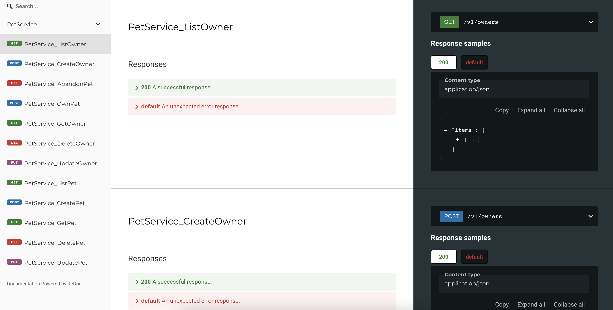

# grpc-gateway：让你同时拥有 grpc 和 http 接口，一键生成 swagger 文档

## 编写 proto 文件

```shell
syntax = "proto3";

package pet.service.v1;
option go_package = ".;petpb";

import "google/protobuf/empty.proto";
import "google/api/annotations.proto";
import "google/protobuf/timestamp.proto";

service PetService {
  rpc ListPet (google.protobuf.Empty) returns (PetList) {
    option (google.api.http) = {
      get: "/v1/pets"
    };
  }

  rpc GetPet (Id) returns (Pet) {
    option (google.api.http) = {
      get: "/v1/pets/{id}"
    };
  }

  rpc CreatePet (Pet) returns (Pet) {
    option (google.api.http) = {
      post: "/v1/pets"
    };
  }

  rpc UpdatePet (Pet) returns (Pet) {
    option (google.api.http) = {
      put: "/v1/pets/{id}"
    };
  }

  rpc DeletePet (Id) returns (google.protobuf.Empty) {
    option (google.api.http) = {
      delete: "/v1/pets/{id}"
    };
  }
}

message Id {
  string id = 1;
}

message PetList {
  repeated Pet items = 1;
}

message Pet {
  string id = 1;
  google.protobuf.Timestamp createdAt = 2;
  google.protobuf.Timestamp updatedAt = 3;
  string name = 4;
  string type = 5;
  string  sex = 6;
  uint32 age = 7;
  bool owned = 8;
}
```

_先决条件：_
- protoc 已安装，参考：https://grpc.io/docs/protoc-installation/#install-using-a-package-manager
```shell
# MacOS
brew install protobuf
```
- grpc-gateway protoc 插件已安装
```sh
go install \
github.com/grpc-ecosystem/grpc-gateway/v2/protoc-gen-grpc-gateway \
github.com/grpc-ecosystem/grpc-gateway/v2/protoc-gen-openapiv2 \
google.golang.org/protobuf/cmd/protoc-gen-go \
google.golang.org/grpc/cmd/protoc-gen-go-grpc
```

生成桩代码及 swagger 文档：
```sh
protoc -I/usr/local/include -I. \
		-I${GOPATH}/protobuf \
		--go_out . --go_opt paths=source_relative \
		--go-grpc_out . --go-grpc_opt paths=source_relative \
		--grpc-gateway_out . --grpc-gateway_opt paths=source_relative \
		--grpc-gateway_opt logtostderr=true \
        --grpc-gateway_opt generate_unbound_methods=true \
        --grpc-gateway_opt register_func_suffix=GW \
        --grpc-gateway_opt allow_delete_body=true \
        --openapiv2_out . --openapiv2_opt logtostderr=true \
		pet.proto
```

## 生成文档
_先决条件：_
- docker 已安装并运行

有了 `swagger.json` 借助 swagger 相关的工具我们就可以生成文档了。这里我们使用 [redoc](https://github.com/Redocly/redoc)，通过容器启动一个 server 渲染文档：
```sh
docker run -it --rm -p 80:80 \
      -v $$(pwd)/pet.swagger.json:/usr/share/nginx/html/swagger.yaml \
      -e SPEC_URL=swagger.yaml redocly/redoc
```
浏览器访问 localhost，就能打开漂亮的文档页面了：



## 实现接口，启动服务
先启动 grpc server，这里同时通过 grpc-middleware 注入了一些常用中间件：

```shell
s := grpc.NewServer(
    grpc.UnaryInterceptor(grpc_middleware.ChainUnaryServer(
        grpc_opentracing.UnaryServerInterceptor(),
        grpc_prometheus.UnaryServerInterceptor,
        grpc_logrus.UnaryServerInterceptor(logrusEntry),
        grpc_recovery.UnaryServerInterceptor(),
    )),
)
petpb.RegisterPetServiceServer(s, petsvc.NewPetService())

log.Infof("grpc server start: %s", addr)
if err := s.Serve(lis); err != nil {
    log.Fatalf("failed to serve: %v", err)
}
```

再启动 grpc-gateway，这里依赖 grpc server 的地址：
```go
err := gw.RegisterPetServiceGWFromEndpoint(ctx, mux, grpcAddr, opts)
if err != nil {
    return err
}

log.Infof("gateway server start: %s", gatewayAddr)
http.ListenAndServe(gatewayAddr, mux)
```

原理是在 grpc server 之前做了一层 http 反向代理，将 http 请求转为 protobuf 送给后端的 grpc server，对返回值再做一次转换。[官方架构图](https://github.com/grpc-ecosystem/grpc-gateway#about) 画的比较清楚了。

## 完整代码
_先决条件：_
- make 命令已安装

proto 及 swagger：https://github.com/win5do/go-microservice-demo/tree/main/pkg/api/petpb

执行 `make gen` 生成 grpc 桩代码及 swagger.json 文档。

执行 `make serve-docs` 启动容器渲染文档。

grpc 及 gateway：https://github.com/win5do/go-microservice-demo/tree/main/pkg/server/grpc

## Reference

https://github.com/grpc-ecosystem/grpc-gateway
